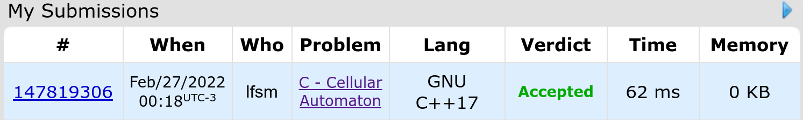

**Description:**

---
**Codeforces result:**

---
**Fast explain:**

The problem is about understanding this is a cyclic matrix and calculating the power of this matrix as fast as possible, using divide and conquer and iterating log k times instead of k times.
